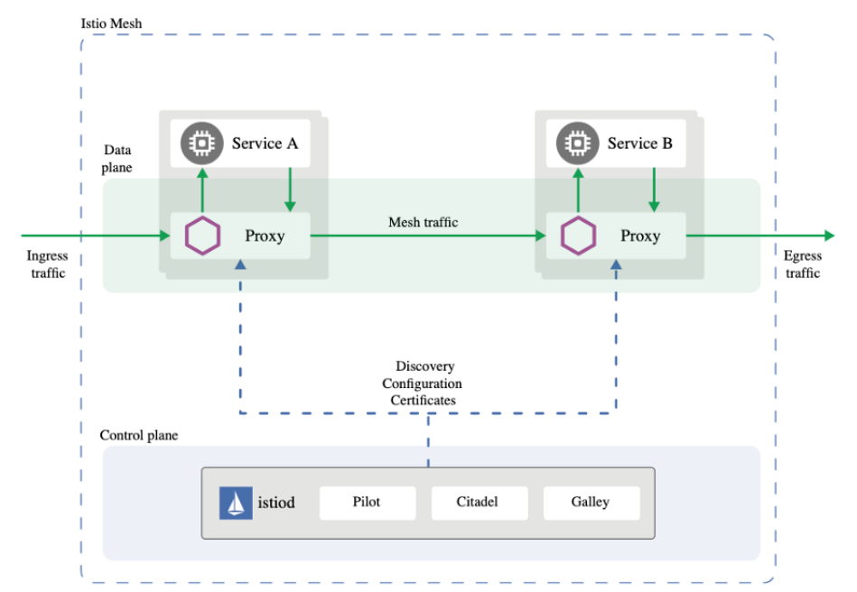
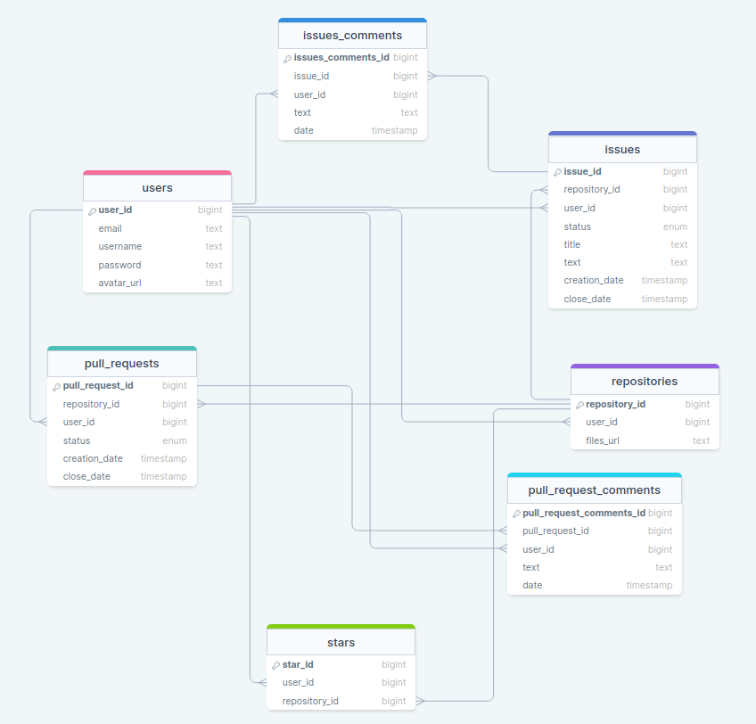

# Проектирование высоконагруженного сервиса для хостинга проектов и их совместной разработки GitHub

Курсовая работа в рамках 3-го семестра программы по Веб-разработке ОЦ VK x МГТУ им. Н.Э. Баумана (ex. "Технопарк") по
дисциплине "Проектирование высоконагруженных сервисов"

#### [Задание](https://github.com/init/highload/blob/main/homework_architecture.md)

#### Автор - Захаров Владимир

## Содержание

- [Проектирование высоконагруженного сервиса для хостинга проектов и их совместной разработки GitHub](#проектирование-высоконагруженного-сервиса-для-хостинга-проектов-и-их-совместной-разработки-GitHub)
    - [Содержание](#содержание)
    - [1. Тема и целевая аудитория](#1-тема-и-целевая-аудитория)
        - [1.1 Тема](#11-тема)
        - [1.2 Целевая аудитория](#12-целевая-аудитория)
        - [1.3 MVP](#13-mvp)
        - [1.4 Ключевой функционал сервиса](#14-ключевой-функционал-сервиса)
    - [2. Расчет нагрузки](#2-расчет-нагрузки)
        - TODO
    - [3. Глобальная балансировка нагрузки](#3-глобальная-балансировка-нагрузки)
        - [3.1 Расположение ЦД](#31-расположение-цд)
        - [3.2 DNS Балансировка](#32-dns-балансировка)
        - [3.3 Балансировка внутри регионов](#33-балансировка-внутри-регионов)
        - [3.4 Кэширование](#34-кэширование)
    - [4. Локальная балансировка нагрузки](#4-локальная-балансировка-нагрузки)
        - [4.1 Первичный контур](#41-первичный-контур)
        - [4.2 Промежуточный контур](#42-промежуточный-контур)
        - [4.3 Конечный контур](#43-конечный-контур)
    - [Список использованной литературы](#список-использованной-литературы)

## 1. Тема и целевая аудитория

### 1.1 Тема

GitHub - веб-сервис для хостинга IT-проектов и их совместной разработки. Веб-сервис основан на системе контроля версий
Git.

Категория - Git.

### 1.2 Целевая аудитория

***DAU*** = 14+ миллионов пользователей в день; </br>
***MAU*** = 433+ миллионов посещений в месяц. [^1]

Гендерное распределение [^2]:


Географическое распределение [^3]:


### 1.3 MVP

1. Регистрация и авторизация;
2. Работа с репозиториями:
    1. Создание;
    2. Редактирование;
    3. Настройка;
    4. Поиск;
    5. Удаление;
3. Работа с ветками;
4. Уведомление пользователей о деятельности в репозиториях, на которые они подписаны.

### 1.4 Ключевой функционал сервиса

1. Регистрация и авторизация;
2. Работа с репозиториями:
    1. Создание;
    2. Редактирование;
    3. Поиск;
    4. Удаление;
    5. Pull Request:
        1. Создание;
        2. Редактирование;
        3. Закрытие;
        4. Комментирование;
            1. Реакции на комментарии;
    6. Issues:
        1. Создание;
        2. Редактирование;
        3. Закрытие;
        4. Комментирование;
            1. Реакции на комментарии;
    7. Fork;
    8. Просмотр статистики;
    9. Возможность добавить в избранное;
3. Работа с ветками;
4. Уведомление пользователей о деятельности в репозиториях, на которые они подписаны;
5. GitHub Actions - автоматизации рабочих процессов;

## 2. Расчет нагрузки

### 2.1 Продуктовые метрики

#### 2.1.1 Целевая аудитория

***DAU*** = 14+ миллионов пользователей в день; </br>
***MAU*** = 433+ миллионов посещений в месяц. [^1]

#### 2.1.2 Статистика по действиям

По данным статистического отчета github за 2022 год:

- На github хостилось более 340 миллионов, а создано было более 87,5 миллионов новых репозиториев;
  > Можем предположить, что количество репозитореев составляет примерно 420M.
  > Тогда каждый пользователь в среднем имеет `420M /100M = 4.2`, то
  > есть в среднем `4` репозитория на одного пользователя.
  >
  > Средний размер репозитория на GitHub может варьироваться в зависимости от типа проекта и содержимого. Однако, в
  > целом, многие репозитории на GitHub имеют размер от нескольких десятков килобайт до нескольких гигабайт, но
  > большинство значений попадает в диапазон `1—30 Мб`. Поэтому в качетве среднего значения возьмём **`15 Мб`**.

- Коммитов совершенно более 3,5 миллиардов;
- Более 227 миллионов ***влитых*** PR;
  > Пользователь создаёт **~2** Pull Requests в неделю, исходя из большинства открытых репозиториев на github, в среднем
  > в репозитории 5 Pull Requests, тогда учитывая, что один Pull Request занимает примерно **1 Кб**, в репозитории Pull
  > Requests занимают **`5 Кб`**.
  >
  > В одном репозитории около 15 комментариев, а средняя длина комментария 100 символов ~ **`1.47 Кб`**.

- Более 31 миллиона Issues ***закрыто*** или ***решено***;
  > Предположим, что всего Issues ~ x2 от закрытых = ~70 миллионов
  >
  > Один пользователь создает около **2** Issues в месяц, а каждый
  > репозиторий имеет в среднем **5** Issues, предположим, что 1 Issue это 256 байт, тогда в репозитории они будут
  > занимать около **`1.25 Кб`**.
  >
  > Примерно 5 комментариев у каждого Issues, а средняя длина комментария 100 символов ~ **`0.49 Кб`**.
- Github Actions сработало более 263 миллионов раз.

Также предположим, что 60% пользователей имеют аватарку в профиле и ее размер 150КБ.

Получаем средний размер хранилища пользователя:

```
(15 * 4) Мб + 5 Кб + 1.47 Кб + 1.25 Кб + 0.49 Кб + 150 Кб = 60 Мб
```

#### 2.1.3 Среднее количество действий пользователя по типам за период.

| Тип действия                         | Количество | Период | | Количество в день |
|--------------------------------------|------------|--------|-|-------------------|
| Создание репозитория                 | 1          | месяц  | | 0.03              |       
| Клонирование репозитория             | 2          | месяц  | | 0.06              |       
| Загрузка новых данных из репозитория | 3          | день   | | 3                 |       
| Редактирование репозитория           | 5          | день   | | 5                 |       
| Открытие Pull Request                | 2          | неделя | | 0.3               |       
| Просмотр Pull Request                | 2          | день   | | 2                 |       
| Добавление комментария               | 2          | день   | | 2                 |       
| Просмотр комментариев                | 2          | день   | | 2                 |       
| Открытие Issue                       | 1          | месяц  | | 0.03              |       
| Просмотр Issue                       | 1          | день   | | 1                 |       
| Добавление в Stared                  | 2          | неделя | | 0.3               |       

### 2.2 Технические метрики

#### 2.2.1 Размер хранения в разбивке по типам данных

| Тип                 | Размер 1 шт. | Размер всего |
|---------------------|--------------|--------------|
| Репозитории         | 15 МБ        | 6300 Тб      |
| Pull Request        | 5 Кб         | 2.1 Тб       |
| Issue               | 1.25 КБ      | 525 ГБ       |
| Комментарии         | 1.47 КБ      | 617.4 ГБ     |
| Аватар пользователя | 150 КБ       | 8.46 ТБ      |
| Star                | 1 Кб         | 420 Гб       |

#### 2.2.2 Сетевой трафик

Так как количество уникальных пользователей в
день составляет **14M+**, то в качестве дневной аудитории возьмём **40M**, так как часть пользователей посещает сервис
несколько раз в течение дня.

Согласно [^1] пользователь в среднем посещает **6.69** страниц в день, округлим
это число до **7** страниц в день.
При повторном посещении страницы клиентом в JS используется кэширование, что позволяет избежать загрузки страницы с
сервера. Таким образом, фактическое количество загружаемых страниц может быть меньше 7, но возьмем 7 запросов как худший
реузльтат.

Будем предполагать, что из 7 страниц:

- стартовая страница
- страница со списком репозиториев пользователя
- 2 страницы кода выбранного репозитория
- страница с Pull Requests
- страница Issues
- страница профиля пользователя

Используя. "инструменты разработчика" в браузере мы можем примерно рассчитать размер .html, .js и .css файлов для
отрисовки каждой из страниц и количество запросов для их получения, в качестве данных возьмём средний результат:

| Страница                         | Размер в Кб | Кол-во запросов |
|----------------------------------|-------------|-----------------|
| стартовая страница               | 742         | 71              |
| список репозиториев пользователя | 793         | 87              |
| код репозитория                  | 783         | 90              |
| Pull Requests                    | 620         | 71              |
| Issues                           | 611         | 68              |
| профиль пользователя             | 740         | 74              |

Получаем средний размер трафика и запросов для **статики на одного пользователя в день**:

```
Трафик: 742 + 793 + 783*2 + 620 + 611 + 740 = 4.9 Мб
Кол-во
запросов: 71 + 87 + 90*2 + 71 + 68 + 74 = 551
```

Тогда учитывая количество пользователей, получаем:

```
Трафик: 4.9 Мб * 40М / 86 400 = 2.2 Гб/c
RPS: 551 * 40М / 86 400 = 255 000
```

Рассмотрим запросы из продуктовых требований для расчёта сетевой нагрузки. Для рассчёта RPS используем формулу:

```
 <дневная аудитория> * <средняя частота выполнения данного запроса в сутки одним пользователем> / 86 400(кол-во секунд в сутках)
```

Для рассчёта трафика:

```
<средний объём данных переданных по сети для данного типа запроса> * RPS
```

1. Создание репозитория
    ```
    RPS: 40М / 86 400 / 30 = 15.43
    Трафик: 3.9 * 15.43 = 60.2 Кб/с 
    ```

2. Клонирование репозитория
    ```
    RPS: 40М / 86 400 * 2 / 30 = 30.9
    Трафик: 15360 * 30.9 = 0,47 Гб/с 
    ```

3. Загрузка новых данных из репозитория (git pull)
    ```
    RPS: 40М / 86 400 * 3 = 1389
    Трафик: 3.6 * 1389 = 5 Мб/с 
    ```

4. Редактирование репозитория
    ```
    RPS: 40М / 86 400 * 5 = 2315
    Трафик: 3.3 * 2315 = 7.6 Мб/с 
    ```

5. Открытие Pull Request
    ```
    RPS: 40М / 86 400 * 2/7 = 132.3
    Трафик: 3.4 * 132.3 = 0.5 Мб/с 
    ```

6. Просмотр Pull Request
    ```
    RPS: 40М / 86 400 * 2 = 926
    Трафик: 50 * 926 = 46.3 Мб/с 
    ```

7. Добавление комментария
    ```
    RPS: 40М / 86 400 * 2 = 926
    Трафик: 19 * 926 = 17.6 Мб/с
    ```

8. Просмотр комментариев
    ```
    RPS: 40М / 86 400 * 2 = 926
    Трафик: 90 * 926 = 83.34 Мб/с 
    ```

9. Открытие Issues
    ```
    RPS: 40М / 86 400 / 30 = 15.43
    Трафик: 3.3 * 15.43 = 51 Кб/с 
    ```

10. Просмотр Issues
    ```
    RPS: 40М / 86 400 = 463
    Трафик: 37 * 463 = 16.72 Мб/с 
    ```

11. Поиск
    ```
    RPS: 40М / 86 400 = 463
    Трафик: 0,11 * 463 = 50 Мб/с 
    ```

12. Добавление в stared
    ```
    RPS: 40М / 86 400 * 2/7 = 132.3
    Трафик: 0,11 * 132.3 = 14.52 Мб/с 
    ```

#### 2.2.3 RPS

| Запрос                                          | RPS   | Трафик     |   
|-------------------------------------------------|-------|------------|
| Создание репозитория                            | 15.43 | 60.2  Кб/с |
| Клонирование репозитория                        | 30.9  | 0,47 Гб/с  |
| Загрузка новых данных из репозитория (git pull) | 1389  | 5 Мб/с     |
| Редактирование репозитория                      | 2315  | 7.6 Мб/с   |
| Открытие Pull Request                           | 132.3 | 0.5 Мб/с   |
| Просмотр Pull Request                           | 926   | 46.3  Мб/с |
| Добавление комментария                          | 926   | 17.6 Мб/с  |
| Просмотр комментариев                           | 926   | 83.34 Мб/с |
| Открытие Issues                                 | 15.43 | 51  Кб/с   |
| Просмотр Issues                                 | 463   | 16.72 Мб/с |
| Поиск                                           | 463   | 50 Мб/с    |
| Stared                                          | 132.3 | 14.52 Мб/c |

## 3. Глобальная балансировка нагрузки

Из ранее расмотренного географического распределения[^3] имеем глобальное распределение ресурсов, следовательно серверы
необходимо размещать в разных странах для
обеспечения стабильного подключения. Имеем преобдлание
аудитории из Северной Америки, и Северной и Южной Азии.

| Регион           | Процент пользователей (Примерное) | 
|------------------|-----------------------------------|
| Северная америка | 17                                |
| Северная Азия    | 16                                |
| Южная Азия       | 10                                |
| Другое           | 57                                |

### 3.1 Расположение ЦД

Расположим сервера с учетом географического распредления трафика:

- 3 ДЦ в Америке
    - 2 ДЦ в Северной Америке, а именно США, для покрытия региона, из которого исходит основной трафик. Расположим
      Сервера в наиболее нагруженных точках
        - В штате Вашингтон
        - В штате Нью-Мексика
    - ДЦ в Южной Америке, чтобы перенаправить дополнительный трафик в отдельный сервер, расположим его в Бразилии
- 2 ДЦ В Европе
    - ДЦ во Франкфурте для покрытия Европы
    - ДЦ в Москве для покрытия России и стран СНГ
- 2 ДЦ в Азиии
    - Северную Азию покроем сервером в Китае
    - Южную Азию покроем сервером в Индии
- 1 ДЦ в ЮАР

### 3.2 DNS Балансировка

Для DNS балансировки будем использовать `GeoDNS`, который будет подбирать ближайший сервер на основе местоположения
запроса. Разместим DNS-серверы в основных регионах по крайней мере 2-3 DNS-сервера в
каждом регионе для обеспечения высокой доступности и отказоустойчивость. Такое количество позволит балансировать
нагрузку и обеспечивать резервирование в случае сбоев.

### 3.3 Балансировка внутри регионов

Будем использовать `Latency-based routing` для перенаправления трафика на сервер с наименьшей задержкой внутри региона.

### 3.4 Кэширование

Воспользуемся `CDN`(например, `Cloudflare`) для раздачи статики: аватарок и других изображений. Таким образом мы сможем
снизить нагрузку на ДЦ и ускорить загрузку изображений у пользователей

## 4. Локальная балансировка нагрузки

### 4.1 Первичный контур

Настроим `VRRP` на маршрутизаторах в каждом датацентре, это увеличит доступность маршрутизаторов и отказоусточивость
сервиса. Это достигается
путём объединения группы маршрутизаторов в один виртуальный маршрутизатор и назначения им общего IP-адреса, который и
будет использоваться как шлюз по умолчанию.

В любой момент времени только один из физических маршрутизаторов выполняет
маршрутизацию трафика, то есть становится `VRRP Master router`, остальные маршрутизаторы в группе
становятся `VRRP Backup router`. Если текущий `VRRP Master router` становится недоступным, то его роль берет на себя
один
из `VRRP Backup` маршрутизаторов, тот у которого наивысший приоритет.

### 4.2 Промежуточный контур

После маршрутизаторов используем `L3` балансировщик. Используем `VS via DR`, чтобы не упереться по выходному трафику в
балансер, а пускать трафик в обход ему.

### 4.3 Конечный контур

На конечном контуре будем использовать `L7 балансировщик - envoy` в качестве `sidecar proxy` для
осуществления `istio service mesh`



`Istiod` отвечает за обнаружение сервисов, конфигурацию и управление сертификатами. Он преобразует высокоуровневые
правила маршрутизации трафика в конфигурации для `Envoy`, а затем распространяет их по sidecar-контейнерам в рантайме.

`Envoy` развёртываются как sidecar’ы в подах и дают несколько возможностей:

- динамическое обнаружение сервисов;
- балансировки нагрузки;
- терминация TLS;
- прокси HTTP/2 и gRPC;
- размыкатели цепи;
- проверки работоспособности;
- постепенное развёртывание с процентным разделением трафика;
- внесение ошибок;
- всевозможные метрики.

Плюсом использования `Istio` является тот факт, что еслы мы установим его в `Kubernetes` и создадим под,
контейнер `Envoy` будет внедрен в него
автоматически — его не придётся объявлять в манифесте пода

## 5. Логическая схема БД



## Список использованной литературы

[^1]: [GitHub Traffic Analysis](https://hypestat.com/info/github.com)
[^2]: [GitHub Audience Analysis](https://www.similarweb.com/website/github.com/#demographics)
[^3]: [GitHub Geography Analysis](https://www.similarweb.com/website/github.com/#geography)
