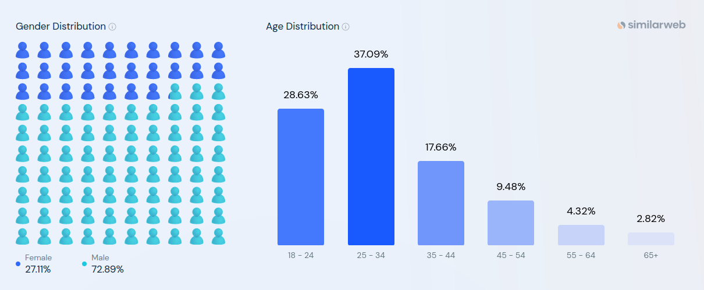
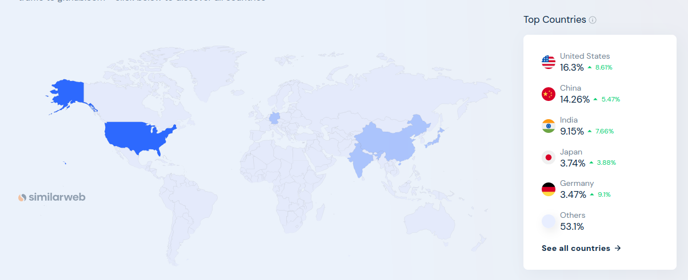

# Проектирование высоконагруженного сервиса для хостинга проектов и их совместной разработки GitHub

Курсовая работа в рамках 3-го семестра программы по Веб-разработке ОЦ VK x МГТУ им. Н.Э. Баумана (ex. "Технопарк") по
дисциплине "Проектирование высоконагруженных сервисов"

#### [Задание](https://github.com/init/highload/blob/main/homework_architecture.md)

#### Автор - Захаров Владимир

## Содержание

- [Проектирование высоконагруженного сервиса для хостинга проектов и их совместной разработки GitHub](#проектирование-высоконагруженного-сервиса-для-хостинга-проектов-и-их-совместной-разработки-GitHub)
    - [Содержание](#содержание)
    - [1. Тема и целевая аудитория](#1-тема-и-целевая-аудитория)
        - [1.1 Тема](#11-тема)
        - [1.2 Целевая аудитория](#12-целевая-аудитория)
        - [1.3 MVP](#13-mvp)
        - [1.4 Ключевой функционал сервиса](#14-ключевой-функционал-сервиса)
    - [2. Расчет нагрузки](#2-расчет-нагрузки)
        - TODO
    - [3. Глобальная балансировка нагрузки](#3-глобальная-балансировка-нагрузки)
    - [Список использованной литературы](#список-использованной-литературы)

## 1. Тема и целевая аудитория

### 1.1 Тема

GitHub - веб-сервис для хостинга IT-проектов и их совместной разработки. Веб-сервис основан на системе контроля версий
Git.

Категория - Git.

### 1.2 Целевая аудитория

***DAU*** = 14+ миллионов пользователей в день;  
***MAU*** = 433+ миллионов посещений в месяц. [^1]

Гендерное распределение [^2]:

Географическое распределение [^3]:

### 1.3 MVP

1. Регистрация и авторизация;
2. Работа с репозиториями:
    1. Создание;
    2. Редактирование;
    3. Настройка;
    4. Поиск;
    5. Удаление;
3. Работа с ветками;
4. Уведомление пользователей о деятельности в репозиториях, на которые они подписаны.

### 1.4 Ключевой функционал сервиса

1. Регистрация и авторизация;
2. Работа с репозиториями:
    1. Создание;
    2. Редактирование;
    3. Поиск;
    4. Удаление;
    5. Pull Request:
        1. Создание;
        2. Редактирование;
        3. Закрытие;
        4. Комментирование;
            1. Реакции на комментарии;
    6. Issues:
        1. Создание;
        2. Редактирование;
        3. Закрытие;
        4. Комментирование;
            1. Реакции на комментарии;
    7. Fork;
    8. Просмотр статистики;
    9. Возможность добавить в избранное;
3. Работа с ветками;
4. Уведомление пользователей о деятельности в репозиториях, на которые они подписаны;
5. GitHub Actions - автоматизации рабочих процессов;
6. GitHub Pages - создание веб-страницы прямо из репозиториев.

## 2. Расчет нагрузки

### 2.1 Продуктовые метрики

#### 2.1.1 Целевая аудитория

***DAU*** = 14+ миллионов пользователей в день;  
***MAU*** = 433+ миллионов посещений в месяц. [^1]

#### 2.1.2 Статистика по действиям

По данным статистического отчета github за 2022 год:

- На github хостилось более 340 миллионов, а создано было более 87,5 миллионов новых репозиториев;
- Коммитов совершенно более 3,5 миллиардов;
- Более 227 миллионов ***влитых*** PR;
  > предположим, что всего PR ~ x2 от ***влитых*** = ~500 миллионов PR
  >
  > примерно 20 комментариев у каждого PR
- Более 31 миллиона Issues ***закрыто*** или ***решено***;
  > аналогично PR предположим, что всего Issues ~ x2 от закрытых = ~70 миллионов
  >
  > примерно 5 комментариев у каждого Issues
- Github Actions сработало более 263 миллионов раз.

Количество Fork-ов оценим относительно Топ-100 репозиториев по Fork-ам, из которого известно, что суммарное количество
Fork-ов репозиториев из этого топа составляет ~1.5 миллиона
> Будем считать, что всего ~ x10 от этого значения = 15 миллионов

Также предположим, что 60% пользователей имеют аватарку в профиле и ее размер 150КБ.

#### 2.1.3 Среднее количество действий пользователя по типам за период.

| Действие                                  | Кол-во в день | Кол-во в день пик |
|-------------------------------------------|---------------|-------------------|
| Создание репозитория                      | 0.1           |                   |
| Скачивание репозитория pull               | 5             |                   |
| Скачивание репозиториев clone             | 0.3(3)        |                   |
| Добавление изменений в репозиторий commit | 5             | 25                |
| Добавление изменений в репозиторий push   | 1             | 10                |
| Создание issue                            | 0.03(3)       |                   |
| Получение issue                           | 0.03(3)       |                   |
| Добавление комментария                    | 10            |                   |
| Получение комментариев                    | 20            |                   |

Здесь добавить звездочки

### 2.2 Технические метрики

#### 2.2.1 Размер хранения в разбивке по типам данных

| Тип                 | Количество в шт. | Размер 1 шт. | Размер всего |
|---------------------|------------------|--------------|--------------|
| Репозитории         | 90 000 000       | 100 МБ       | 9 ПБ         |
| Pull Request        | 500 000 000      | 10 Мб        | 5 ПБ         |
| Issue               | 70 000 000       | 1 КБ         | 70 ГБ        |
| Комментарии         | 10 140 000 000   | 1 КБ         | 10.14 ГБ     |
| Аватар пользователя | 56 400 000       | 150 КБ       | 8.46 ТБ      | 

Сетевой трафик

#### 2.2.2 RPS

| Действия                                  | RPS             | RPS пик |
|-------------------------------------------|-----------------|---------|
| Создание репозитория                      | 16.2            |         |
| Скачивание репозитория pull               | 810.2           |         |
| Скачивание репозиториев clone             | 53.5            |         |
| Добавление изменений в репозиторий commit | 810.2           | 4051    |
| Добавление изменений в репозиторий push   | 162             | 1620.4  |
| Создание issue                            | 5.3             |         |
| Получение issue                           | 5.3             |         |
| Добавление комментария                    | 1620.4 скрутить |         |
| Получение комментариев                    | 3240.7 скрутить |         |

Здесь добавить звездочки

## 3. Глобальная балансировка нагрузки

### 3.1 Расположение ЦД

Из ранее расмотренного географического распределения[^3] имеем глобальное распределение ресурсов с преобдланием аудитории из Северной Америки, Северной и Южной Азии. Следовательно серверы необходимо размещать в разных странах для обеспечения стабильного подключения.

Расположим сервера с учетом географического распредления трафика:
- 3 ДЦ в Америке
  - 2 ДЦ в Северной Америке, а именно США, для покрытия региона, из которого исходит основной трафик
    - В штате Вирджиния
    - В штате Колорадо
  - ДЦ в Южной Америке, чтобы перенаправить дополнительный трафик в отдельный сервер, расположим его в Бразилии
- 2 ДЦ В Европе
  - ДЦ во Франкфурте для покрытия Европы
  - ДЦ в Москве для покрытия России и стран СНГ
- 2 ДЦ в Азиии
  - Северную Азию покроем сервером в Китае 
  - Южную Азию покроем сервером в Индии

## Список использованной литературы

[^1]: [GitHub Traffic Analysis](https://hypestat.com/info/github.com)
[^2]: [GitHub Audience Analysis](https://www.similarweb.com/website/github.com/#demographics)
[^3]: [GitHub Geography Analysis](https://www.similarweb.com/website/github.com/#geography)
